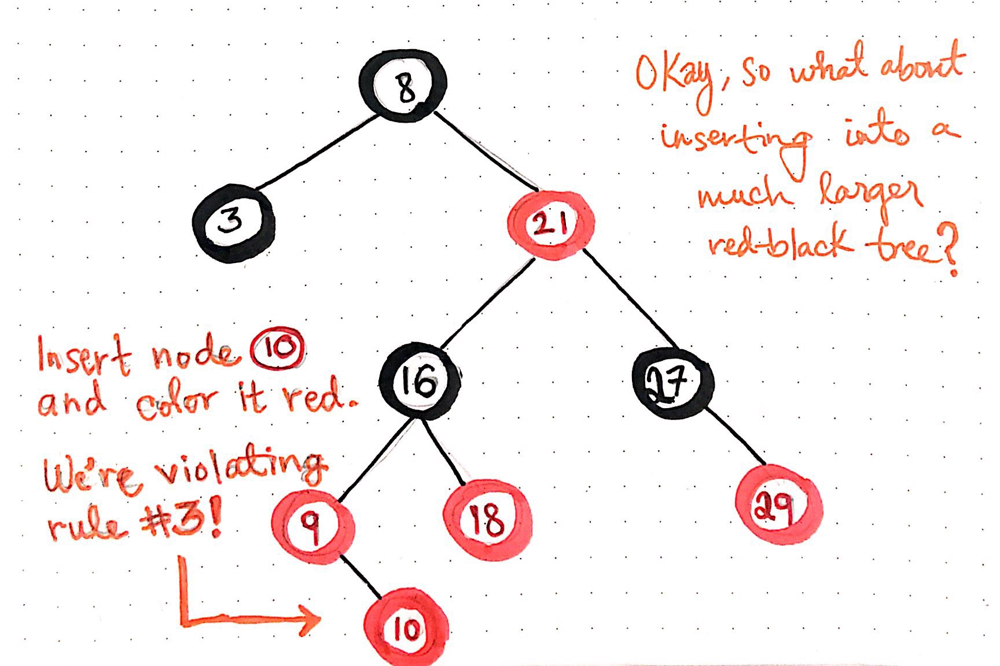

# Generic Socket Framework
> It is a java based framework which helps the programmers to free themselves from writing socket programming code.while creating client-server based application.It can also create 

## Table of contents
* [General info](#general-info)
* [Screenshots](#screenshots)
* [Technologies](#technologies)
* [Setup](#setup)
* [Features](#features)
* [Status](#status)
* [Inspiration](#inspiration)
* [Contact](#contact)

## General info
Add more general information about project. What the purpose of the project is? Motivation?

## Screenshots

## Technologies
* Tech 1 - version 1.0

## Setup 
* [Download](https://drive.google.com/open?id=1jhwxy-dZDWT5k8sDxSvSmJ6iTkG-mFPK) and copy the jar files to your network based application folder
 'nafclient.jar' to client folder  and 'nafserver.jar' to server folder.
* Create @bin package.cfg@ file and mention the path of services folder in your application. For example
   @bin file:/home/ibrahim/work/naf//@ in Unix/Linux and @bin file:\c:\work\naf@ in Windows
* import packages in your code and create Main class.For more information on how to write Main class Click on below link
* Run the Main class.

## Code Examples
Show examples of usage:
`put-your-code-here`

## Features
List of features ready and TODOs for future development
* Awesome feature 1
* Awesome feature 2
* Awesome feature 3

To-do list:
* Wow improvement to be done 1
* Wow improvement to be done 2

## Status
Project is: _in progress_, _finished_, _no longer continue_ and why?

## Inspiration
Add here credits. Project inspired by..., based on...

## Contact
Created by [@flynerdpl](https://www.flynerd.pl/) - feel free to contact me!
