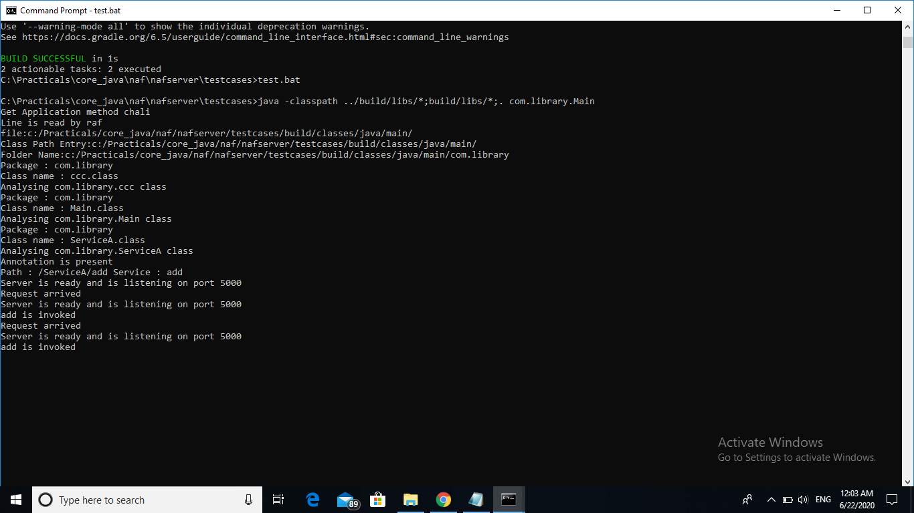

# Generic Socket Framework
> A java based module which helps the programmers to free themselves from writing socket programming code.while creating client-server based application.

## Table of contents
* [General info](#general-info)
* [Screenshots](#screenshots)
* [Technologies](#technologies)
* [Setup](#setup)
* [Features](#features)
* [Status](#status)
* [Contact](#contact)

## General info
Designing client-server based desktop application is always hectic especially writing Socket Programming code.Because in java we have to import so many modules and then create multiple instances of different socket based classes to just connect the server with client.After then we have to send the chunk of 1024 bytes.After doing all these things we could create a simple application.
This inspired me to create a module that will save the time of programmer from writing socket programming code in Java.The programmes just have to import single module in both client and server side and they can focus on buisness logic instead of sending and receiving chunks of bytes. 
## Screenshots


## Technologies
* Java 1.10 or greater

## Setup 
* [Download](https://drive.google.com/drive/folders/1KPqlA9dvWa4CyF0FPudD9ZtxPzr9OdPk?usp=sharing) and copy the jar files to your application folder
 `nafclient.jar` to client folder  and `nafserver.jar` to server folder.
* Create `package.cfg` file and mention the path of the package application. For example
   `file:c:/work/server/src/` in Windows
* import packages in your code and create Main class.For more information on how to write Main class checkout the implementation section below.
* Run the Main class.

## Implementation
Here we have implemented this application to create a simple client-server based application that can add,subtract,multiply two numbers.
Folder Structure for Application is as follows:-

```
├── test-app
   ├── client
       ├── libs
            ├── nafclient.jar
            ├── nafcommon.jar
       ├── src
           ├──com
              ├──app
                 ├──App.java
    ├── server
        ├── libs
           ├── nafserver.jar
           ├── nafcommon.jar
        ├── src
           ├──com
              ├──app
                 ├──Main.java
                 ├──service
                    ├── Service.java
```


## Code Examples
Show examples of usage:

Server Side Main.java
```
package com.app;
import com.thinking.machines.nafserver.*;
import com.thinking.machines.nafcommon.*;
public class Main
{
public static void main(String gg[])
{
TMNAFServer tmnafserver=new TMNAFServer();   // need to construct a parameterized constructor
tmnafserver.startServer();
}
}
```
To compile type ```javac -classpath ..\..\..\libs\*;. Main.java```
and to run the code go to the server folder and type ```java -classpath libs\*;src\ com.app.Main```


Service.java

```
package com.app.service;
import com.thinking.machines.nafserver.annotation.*;
@Path("/service")
public class Service
{
@Path("/add")
public int add(int a,int b)
{
return a+b;
}
@Path("/sub")
public int subtract(int a,int b)
{
return a-b;
}

@Path("/mul")
public int multiply(int a,int b)
{
return a*b;
}

@Path("/div")
public int divide(int a,int b)
{
return a/b;
}
}
```

To compile type ```javac -classpath ..\..\..\..\libs\*;. Service.java```


Client Side App.java

```
package com.app;
import com.thinking.machines.nafclient.*;
import com.thinking.machines.nafcommon.*;
public class App
{
public static void main(String gg[])
{
try
{
TMNAFClient tmnaf=new TMNAFClient("localhost",5000);
System.out.printf("%d\n",tmnaf.process("/service/add",10,70));
System.out.printf("%d\n",tmnaf.process("/service/sub",100,70));
System.out.printf("%d\n",tmnaf.process("/service/mul",10,70));
System.out.printf("%d\n",tmnaf.process("/service/div",140,70));
}catch(ApplicationException ae)
{
System.out.println(ae);
}
}
}
```
To compile type ```javac -classpath ..\..\..\libs\*;. App.java```
and to run ``` java -classpath ..\..\..\libs\*;. App```


## Features
* Easy to learn & implement.
* Programmer does not have to worry about socket connection and handling chunks of bytes.
* Handle multiple requests and give accurate result.
* Error log is provided in PDF format


## Status
Project is finished but there are lot more features that can be added in this application.

## Contact
Created by [@ibrahimAnis]() - feel free to contact me if you face any problem in configuration!
[Linkedin Profile](https://linkedin.com/in/ibrahimanis)
